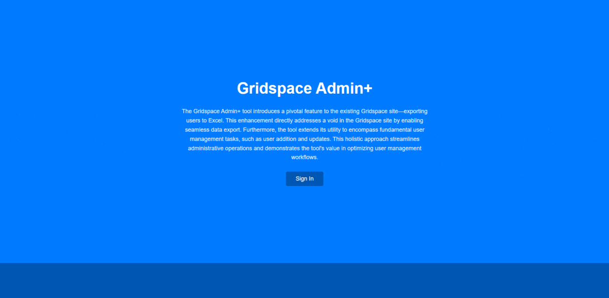

 

  

<h3 align="center">Gridspace Admin+</h3>

  

Gridspace Admin+ is a web application developed to address a critical challenge within Gridspace's monitoring and tracking platform. The problem faced was the absence of a built-in feature to export a list of all users from the platform, which was essential for my team's quarterly audits.
     
    <a href="https://gridspaceadminplus.com">View Website</a>
    ·
    <a href="https://github.com/kleinaitis/gridspace-admin-plus/issues">Report a Bug</a>
    ·
    <a href="https://github.com/kleinaitis/gridspace-admin-plus">Request a Feature</a>
  

  

## The Challenge
As part of our responsibilities, we needed performed regular audits on various systems where we'd compare the list of users in each system to the list of users still active at the company. Because of the lack of export functionality on Gridspace's site, this process previously involved reaching out to the platform's customer service team for assistance, resulting in delays and inefficiencies.

## The Solution
Gridspace Admin+ was created to streamline this process. The application features a user-friendly interface with a landing page and a secure login section. Users log in using their Gridspace Account ID and Secret Key credentials, which are then utilized to make requests with Gridspace's APIs.

After a successful fetch request, a comprehensive list of Gridspace users is seamlessly loaded into the user management section of the application. Here, users can be created, updated, and, most importantly, exported to an Excel file.

(<a href="#readme-top">back to top</a>)

